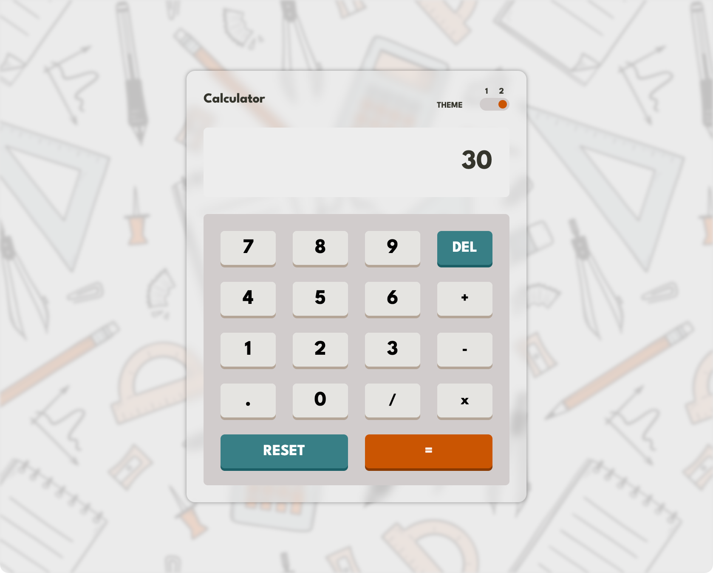
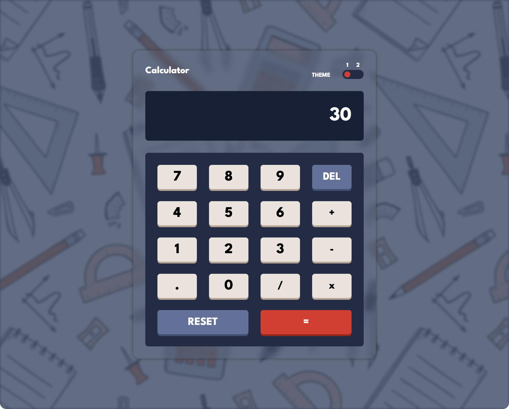

# Calculator Project

## Overview
This simple, interactive calculator web application is built using HTML, CSS, and JavaScript. The calculator allows users to perform basic arithmetic operations such as addition, subtraction, multiplication, and division. It also includes a theme toggle for enhanced user experience and keyboard support for easier input.

## Features
- **Arithmetic Operations:** Perform addition, subtraction, multiplication, and division.
- **Responsive Design:** The layout adapts to different screen sizes.
- **Theme Toggle:** Switch between light and dark themes to customize the look and feel.
- **Keyboard Support:** Use your keyboard to input numbers, operations, and commands.
- **DEL and RESET Buttons:** Delete the last entry or reset the calculator to its initial state.

## Technologies Used
- **HTML:** For structuring the application.
- **CSS:** For styling, themes, and responsive design.
- **JavaScript:** This is for handling calculations, interactivity, and keyboard support.

## Project Structure
```
Calculator/
├── index.html      # Main HTML file
├── style.css       # CSS styles
├── script.js       # JavaScript logic
├── pattern.jpeg    # Background image for styling
```

## Installation
1. Clone the repository:
   ```bash
   git clone https://github.com/your-username/calculator.git
   ```
2. Navigate to the project directory:
   ```bash
   cd calculator
   ```
3. Open `index.html` in your browser.

## Usage
1. Open the calculator in your preferred browser.
2. Use the number buttons to input values or your keyboard for quick entry.
3. Use the operation buttons (`+`, `-`, `*`, `/`) to perform calculations.
4. Use `DEL` to delete the last entered value, `RESET` to clear the calculator, and `=` to display the result.
5. Toggle between light and dark themes using the theme switcher.

## File Breakdown
### HTML (`index.html`)
- Defines the structure of the calculator, including buttons, display, and theme toggle.

### CSS (`style.css`)
- Provides styles for the calculator, including responsive design, themes, and animations.

### JavaScript (`script.js`)
- Implements the calculator logic, button functionalities, theme switching, and keyboard support.

## Screenshots
### Light Theme


### Dark Theme

## Future Enhancements
- Add more advanced operations (e.g., square root, percentage).
- Implement additional themes.
- Improve accessibility features.
- Enhance animations and transitions.

## License
This project is licensed under the MIT License.

## Contact
For any questions or feedback, please contact [mouadassel3@gmail.com].
